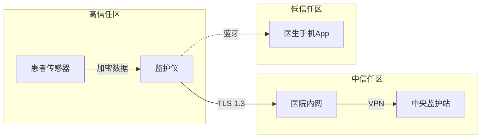

+++
title = "Cybersecurity in Medical Devices: Quality Management System Considerations and Content of Premarket Submissions 解析 - Chapter 3"
date = 2026-06-04T23:45:00+08:00
slug = "cybersecurity-in-medical-devices-quality-management-system-considerations-and-content-of-premarket-submissions-chapter-3-20260604-235418"
tags = ["Cybersecurity in Medical Devices: Quality Management System Considerations and Content of Premarket Submissions"]
draft = false
+++

# 安全控制、SBOM 与 524B：从架构到合规

> 基于 FDA 2026 年 2 月发布的《Cybersecurity in Medical Devices: Quality Management System Considerations and Content of Premarket Submissions》的个人解读。
> 这是四篇系列的第三篇，建议先看完前两篇的概念扫盲，再进入这一篇的实操内容。

前两篇我们聊了 FDA 为什么要发这份新指南，以及 SPDF、QMSR、ISO 13485 这些概念到底是什么。这一篇进入更硬核的部分：安全控制怎么选、架构图怎么画、SBOM 怎么写，以及 Cyber Device 在 524B 条款下到底要交什么文档。

---

## 1. 安全控制实施

指南 Appendix 1 列出了 8 大类安全控制。注意，这不是一个 checklist，不是让你全选。FDA 的态度是：**根据你设备的风险评估结果，选择性实施**。

一个非联网的体温计，和一个联网的起搏器，需要上的安全控制完全不同。这就是后面会讲到的 scaling with risk。

### Authentication（认证）

**核心问题：你怎么确认访问设备的人/系统是它声称的那个？**

常见做法：密码、PIN、硬件 token、双因素认证（2FA）、生物特征识别。对于医疗设备，FDA 特别强调：**默认密码必须可更改，且不能是硬编码的"admin/admin"**。

一个常见的坑：设备支持密码登录，但密码存在明文配置文件里，攻击者拿到固件就全知道了。认证机制本身要有完整性保护。

### Authorization（授权）

**核心问题：确认了身份之后，它能做什么？**

不是每个用户都需要 root 权限。护士站的操作员可能只需要查看实时数据，工程师才需要改配置，管理员才需要推送固件更新。

FDA 建议采用**最小权限原则**（least privilege）：每个角色只给完成工作所需的最小权限集合。这样即使一个账户被攻破，攻击者能造成的损害也被限制在一定范围内。

### Cryptography（加密）

**核心问题：数据在传输和存储过程中，怎么防止被窃听或篡改？**

这是 8 大类里技术门槛最高、也最容易踩坑的一类。FDA 没有指定必须用哪种算法，但有隐含要求：

- **不要使用已被破解或淘汰的算法**：MD5、SHA-1 用于签名已经不够安全，DES/3DES 加密也不建议。
- **密钥管理比算法更重要**：你用 AES-256 很好，但密钥硬编码在固件里，等于把保险箱密码贴在门板上。密钥要有安全存储（Secure Element/TPM/HSM）、定期轮换、泄露响应机制。
- **加密会引入延迟**：参考第二篇提到的 Safety vs Security 冲突，急救场景下的实时数据可能需要权衡。

### Code, Data, and Execution Integrity（代码、数据与执行完整性）

**核心问题：你怎么确认设备跑的是你想让它跑的代码，处理的是没被篡改的数据？**

这通常靠**安全启动（Secure Boot）**和**运行时完整性校验**来实现：

- 开机时，设备先校验固件签名，签名不对就拒绝启动。
- 运行中，关键内存区域定期做完整性校验（比如 CRC、HMAC），发现被篡改就报警或重启。

如果这一步没做好，攻击者可以通过固件篡改、内存注入等方式让设备"看起来正常地工作"，但实际上在执行恶意逻辑。这是最隐蔽的攻击类型之一。

### Confidentiality（机密性）

**核心问题：敏感数据，只有授权的人才能看到。**

和 Cryptography 有重叠，但更偏向**数据分级和访问控制**。患者姓名、病历号、诊断结果、影像数据，都属于敏感信息。即便是设备内部日志，也可能包含可用于推断患者身份的信息（比如结合时间戳和病房号）。

FDA 建议在设计上就考虑**数据脱敏**和**去标识化**，减少不必要的敏感信息留存。

### Event Detection and Logging（事件检测与日志）

**核心问题：出事了，你得知道出了什么事，以及怎么追查。**

日志不是越多越好。FDA 关心的是**安全相关事件**：登录失败、权限越界尝试、固件更新、配置变更、异常网络连接、完整性校验失败等。

关键要求：
- **日志本身要有完整性保护**，不能被攻击者篡改或删除。
- **日志要包含足够的信息**用于事后追溯：时间戳、事件类型、涉及的用户/进程、结果。
- **但日志不能存敏感数据**，比如密码、密钥、完整的患者信息。

### Resiliency and Recovery（弹性与恢复）

**核心问题：被攻击了，设备能不能活过来？**

参考第四篇 P9 的讨论：普通断电不管，但安全事件导致的被迫重启必须纳入设计。关键数据要有备份，恢复后要重新认证网络连接，不自动信任之前的会话。

### Firmware and Software Updates（固件与软件更新）

**核心问题：你怎么安全地给设备打补丁？**

这是全生命周期管理的核心。FDA 在 Section IV.B 把 "Secure and timely updatability and patchability" 列为五大安全目标之一。

关键要求：
- **更新包必须签名**，设备必须校验签名。
- **要有 anti-rollback 机制**，防止被刷回有漏洞的旧版本（参考第四篇 P7）。
- **更新失败后的回滚策略**：如果新固件刷进去起不来了，设备能不能自动回到上一个可用版本？
- **更新不能太频繁也不能太慢**：太频繁医院 IT 部门受不了，太慢漏洞补不上。

---

## 2. 安全架构与架构视图

指南 Appendix 2 要求厂商在提交文档时提供**安全架构视图**。FDA 想看的是：你的设备在一个更大的系统里是怎么工作的，数据怎么流，信任边界在哪，哪些地方可能被攻击。

### 常见的三种图

**数据流图（Data Flow Diagram）**

展示数据从哪来、到哪去、经过哪些处理节点。比如：患者传感器 → 监护仪 → 医院内网 → 中央监护站 → 云端备份。

**信任边界图（Trust Boundary Diagram）**

把系统划分成不同的信任区域，标注区域之间的边界。比如：设备内部是一个高信任区，医院内网是中等信任区，互联网是低信任区。跨信任边界的数据流需要额外的安全控制。

**接口图（Interface Diagram）**

展示设备和其他系统之间的所有接口：蓝牙、WiFi、USB、以太网、串口等。每个接口标注：协议、认证方式、加密要求、数据类型。

### 一个最简单的 mermaid 示例



这张图展示了：
- 数据从传感器到监护仪到中央站的流动路径
- 每种连接使用的协议（TLS 1.3、VPN、蓝牙）
- 三个信任区：设备内部最高，医院内网中等，医生手机App最低

实际提交的文档里，每幅图都要配文字说明，解释：这个接口为什么用蓝牙、为什么医生App是低信任区、如果蓝牙被窃听了会有什么后果、你采取了什么缓解措施。

---

## 3. 第三方软件组件与 SBOM

### SBOM 是什么

**SBOM** 全称 Software Bill of Materials，软件物料清单。你可以把它理解为软件版的"配料表"：你的设备里用了哪些开源组件、第三方库、操作系统，每个组件的版本号、许可证、来源是什么。

以前厂商不需要提交这个。现在 FDA 明确要求，特别是对于 Cyber Device（见下一节）。原因很简单：如果一个开源库被发现漏洞，FDA 和医院需要快速知道哪些设备受影响。没有 SBOM，这就是大海捞针。

### 为什么 SBOM 现在这么热

2021 年 SolarWinds 供应链攻击和 Log4j 漏洞事件之后，全球监管机构都意识到了供应链安全的重要性。你设备再安全，如果底层依赖的一个开源组件有漏洞，整个信任链就断了。

FDA 指南 Section VII.C.3 明确要求 Cyber Device 提交 SBOM，而且要包含 **component support information**：这个组件目前维护状态如何？它的支持截止日期是什么时候？如果停止维护了，你打算怎么办？

### 常见 SBOM 格式

目前主流的 SBOM 格式有两种，你任选一种即可：

**SPDX**（Software Package Data Exchange）

Linux 基金会主导的标准，历史悠久，生态成熟。格式可以是 JSON、XML、YAML 或 tag-value 文本。适合大型企业，工具链丰富。

**CycloneDX**

OWASP 推出的标准，设计上更轻量，对安全场景（漏洞分析、许可证合规）支持更好。格式支持 JSON 和 XML。如果你的团队是第一次做 SBOM，CycloneDX 上手可能更快。

两种格式在内容上基本等价：都包含组件名称、版本、供应商、哈希值、许可证、依赖关系。FDA 没有指定必须用哪种，但建议选一种并保持一致。

### 给个SBOM的例子

这个是SPDX 格式（JSON）
```json
{
  "spdxVersion": "SPDX-2.3",
  "SPDXID": "SPDXRef-DOCUMENT",
  "name": "PatientMonitor-v2.1-SBOM",
  "documentNamespace": "https://example.com/sbom/patient-monitor-2.1",
  "creationInfo": {
    "created": "2026-05-15T10:00:00Z",
    "creators": ["Tool: sbom-generator-1.0.0", "Organization: ExampleMed Inc."]
  },
  "packages": [
    {
      "SPDXID": "SPDXRef-OpenSSL",
      "name": "OpenSSL",
      "versionInfo": "3.0.8",
      "supplier": "Organization: OpenSSL Software Foundation",
      "downloadLocation": "https://www.openssl.org/source/openssl-3.0.8.tar.gz",
      "filesAnalyzed": false,
      "checksums": [
        {
          "algorithm": "SHA256",
          "checksumValue": "6c13d2bf38fdf..."
        }
      ],
      "licenseConcluded": "Apache-2.0",
      "copyrightText": "NOASSERTION"
    },
    {
      "SPDXID": "SPDXRef-FreeRTOS",
      "name": "FreeRTOS",
      "versionInfo": "10.5.1",
      "supplier": "Organization: Amazon Web Services",
      "downloadLocation": "https://github.com/FreeRTOS/FreeRTOS-Kernel/releases/tag/V10.5.1",
      "filesAnalyzed": false,
      "licenseConcluded": "MIT",
      "copyrightText": "NOASSERTION"
    }
  ],
  "relationships": [
    {
      "spdxElementId": "SPDXRef-DOCUMENT",
      "relatedSpdxElement": "SPDXRef-OpenSSL",
      "relationshipType": "DEPENDS_ON"
    },
    {
      "spdxElementId": "SPDXRef-DOCUMENT",
      "relatedSpdxElement": "SPDXRef-FreeRTOS",
      "relationshipType": "DEPENDS_ON"
    }
  ]
}
```

这个是CycloneDX 格式（JSON）

```json
{
  "bomFormat": "CycloneDX",
  "specVersion": "1.5",
  "serialNumber": "urn:uuid:3e671687-395b-41f5-a30f-a58921a692b4",
  "version": 1,
  "metadata": {
    "timestamp": "2026-05-15T10:00:00Z",
    "tools": [
      {
        "vendor": "ExampleMed",
        "name": "sbom-generator",
        "version": "1.0.0"
      }
    ]
  },
  "components": [
    {
      "type": "library",
      "name": "OpenSSL",
      "version": "3.0.8",
      "supplier": {
        "name": "OpenSSL Software Foundation"
      },
      "hashes": [
        {
          "alg": "SHA-256",
          "content": "6c13d2bf38fdf..."
        }
      ],
      "licenses": [
        {
          "license": {
            "id": "Apache-2.0"
          }
        }
      ],
      "purl": "pkg:generic/openssl@3.0.8"
    },
    {
      "type": "library",
      "name": "FreeRTOS",
      "version": "10.5.1",
      "supplier": {
        "name": "Amazon Web Services"
      },
      "licenses": [
        {
          "license": {
            "id": "MIT"
          }
        }
      ],
      "purl": "pkg:github/freertos/freertos-kernel@V10.5.1"
    }
  ]
}
```

对比一下的话，两种格式表达的信息几乎一样：组件名称、版本、供应商、哈希值、许可证、来源地址。区别主要在 JSON 结构和字段命名上。SPDX 更强调"包"和"关系"的概念，CycloneDX 的组件描述更扁平直观。不过这个东西本身就是机器读的（谁会肉眼读JSON也是个能人）。

### SBOM 怎么用

不是交上去就完事了。SBOM 是全生命周期管理的工具：

- **上市前**：用它做漏洞扫描，检查依赖树里有没有已知的 CVE。
- **上市后**：定期更新 SBOM，监控组件的 EOL（End of Life）状态。
- **出事了**：某个开源组件爆出零日漏洞，用 SBOM 快速定位受影响的产品批次和版本。

---

## 4. Cyber Device 与 524B 合规

这是整份指南里法律约束力最强的部分。

### Cyber Device 三要素

FD&C Act Section 524B(c) 定义了 Cyber Device：

> (1) includes software validated, installed, or authorized by the sponsor as a device or in a device;  
> (2) has the ability to connect to the internet;  
> (3) contains any such technological characteristics validated, installed, or authorized by the sponsor that could be vulnerable to cybersecurity threats.

翻译成人话：
1. **含软件**：厂商自己验证、安装或授权的软件/固件
2. **能联网**：有连接互联网的能力（WiFi、以太网、蓝牙间接连网也算）
3. **有漏洞风险**：包含可能被网络威胁利用的技术特征

三要素必须同时满足。如果一个设备有软件但不能联网，或者能联网但没有可被攻击的技术特征，就不算 Cyber Device。

### 524B(b) 逐条解析

这是 Cyber Device 厂商必须遵守的三项核心义务，提交 510(k)/PMA/De Novo 时必须包含相应文档。

**Section 524B(b)(1)：Plans and Procedures（计划和流程）**

厂商必须建立并维护一套书面的计划和流程，用于：
- 监控、识别和解决网络安全漏洞
- 提供协调漏洞披露（Coordinated Vulnerability Disclosure, CVD）的流程
- 确保设备及其关联系统在商业发布时具备合理的网络安全基础

简单来说：你得有个"网络安全应急手册"，告诉 FDA 你怎么发现漏洞、怎么修、怎么披露、怎么通知用户。

**Section 524B(b)(2)：Design, Develop, and Maintain（设计、开发和维护）**

厂商必须设计、开发和维护流程和程序，以提供合理的安全保证，确保设备和相关系统具备网络安全能力。

这就是 SPDF 的法律落地。你得证明：
- 设计阶段做了威胁建模
- 开发阶段实施了安全控制
- 上市后持续监控和更新

**Section 524B(b)(3)：Software Bill of Materials（SBOM）**

提交上市前申请时，必须包含 SBOM。对于商业现货软件（COTS）和开源组件，要列出：
- 组件名称和版本
- 来源（供应商或开源社区）
- 支持状态（是否还在维护）
- 生命周期终止计划

这就是前面第三节讲的 SBOM，现在从"建议"变成了"法律要求"。

### 变更管理

指南 Section VII.D 讨论了变更是否需要重新评估网络安全：

**可能需要重新评估的变更**：
- 增加新的网络连接能力（比如从仅蓝牙升级到支持 WiFi）
- 修改认证或加密机制
- 更换第三方组件，特别是引入新的依赖
- 修改安全架构或信任边界

**不太可能需要重新评估的变更**：
- UI 文字修改
- 非安全相关的 bug 修复
- 不影响数据流或接口的内部重构

FDA 建议厂商建立一个内部的变更分类流程，提前判断哪些变更触发网络安全审查。

---

## 5. Scaling with Risk：文档深度与风险成比例

指南 Appendix 4 提供了一张文档缩放表，核心理念是：**你的文档和控制措施的深度，应该和你的设备的网络安全风险成比例**。

### 低风险设备：非联网体温计 （一般已经渗透成筛子了）

- 只有固件，没有网络连接
- 数据传输靠物理接口（USB 导出到电脑）
- 威胁建模：范围有限，主要考虑固件完整性和物理接口安全
- 文档要求：简化的威胁模型、基本的安全控制清单、简化的 SBOM
- 不需要完整的网络渗透测试报告

### 高风险设备：联网起搏器 （仅用于举例，真有人用这东西吗）

- 持续联网（蜂窝网络或 WiFi）
- 支持远程监控和固件更新
- 直接作用于患者心脏
- 威胁建模：必须覆盖完整的医疗系统，包括云端服务器、医院网络、患者手机 App
- 文档要求：
  - 完整的威胁模型和网络安全风险评估
  - 详细的安全架构视图（数据流图、信任边界图、接口图）
  - 全面的安全控制实施证据
  - 完整的 SBOM 和组件生命周期计划
  - 渗透测试、模糊测试、代码审计报告
  - 网络安全管理计划（Cybersecurity Management Plan）
  - 上市后漏洞监控和响应流程

### 判断风险等级的因素

FDA 在指南里列了这些因素：

- 设备的 intended use 和 indications for use
- 设备的连接能力和数据接口
- 漏洞的可利用性（exploitability）
- 漏洞被利用后对患者造成伤害的风险
- 设备在医疗系统中的关键程度

简单来说：**设备越关键、越联网、越容易被攻击、攻击后果越严重，你要交的文档就越多。**

---

## 小结

这一篇我们覆盖了指南最核心的实操内容：

| 主题 | 核心要点 |
|------|---------|
| 8 大安全控制 | 按风险选择性实施，不是全选 |
| 安全架构视图 | 数据流图 + 信任边界图 + 接口图，配文字说明 |
| SBOM | 软件配料表，SPDX 或 CycloneDX 格式 |
| 524B 合规 | Cyber Device 三要素 + (b)(1)(2)(3) 三项义务 |
| Scaling with Risk | 文档深度和风险成比例，体温计 ≠ 起搏器 |

下一篇（也是最后一篇），我们会用 10 个 Corner Case 的 Q&A 形式，把前面三篇的理论放到真实场景里检验。

---

*（未完待续）*
